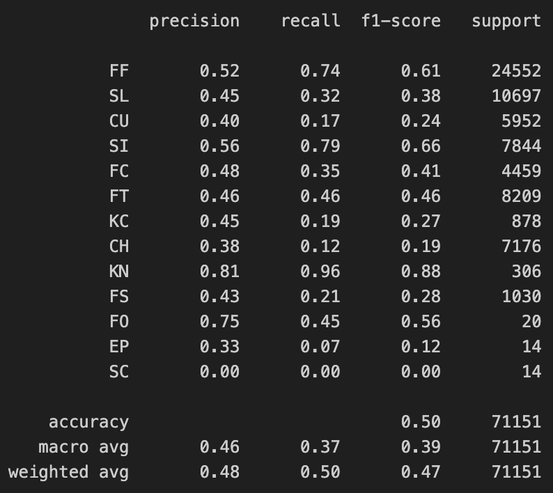
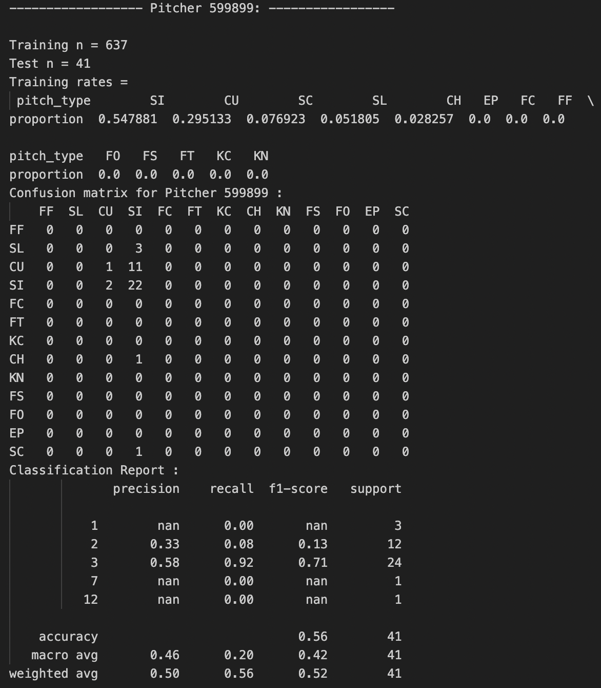

# Goal 
For every pitch an MLB pitcher is about to throw, the goal is to predict what type of pitch it will be. There are 19 unique [pitch types](https://www.mlb.com/news/identifying-pitch-types-a-fan-s-guide) in the full dataset comprised of all pitches from the 2011 MLB season.

Fastballs:
* 'FA', Fastball  
* 'FF', Four-Seam Fastball
* 'FT', Two-Seam Fastball
* 'SI', Sinker 
* 'FC', Fastball (cutter)
* 'FS', Split-Fingered  

Breaking Balls: (defined by movement)  
* 'SL', Slider 
* 'CU', Curveball 
* 'CH', Changeup
* 'KC', Knuckle-Curve  
* 'KN', Knucleball   
* 'EP', Eephus 

Other:   
* 'UN', Unidentified  
* 'PO', Pitch out   
* 'FO', Forkball  
* 'SC', Screwball  
* 'IN', Intentional Ball  
* 'AB', Automatic Ball 

# Exploratory Data Analysis

There are 662 unique pitchers in the dataset. There are a wide range of different pitch type distributions from different pitchers. Multiple pitchers with hundreds of pitchers throw Four-Seam Fastballs over 80% of the time while some never throw them. Around 15% of pitchers throw Four-Seam Fastballs less than 10% of the time. For every one of 'FF', 'FT', 'SI', 'FC', 'FS', 'SL', 'CU', there's at least one pitcher who throws that type at least 75% of the time (with a reasonably large sample size).

The distribution of pitch types:

# Data PreProcessing

I removed Fastballs (FA) from the dataset as (from my understanding) this could mean either a Two-Seam (FT) or Four-Seam (FF) Fastball and the number present in the dataset (204) was relatively insignificant (0.029%).

I also removed 'AB', 'IN', 'PO', and 'UN', which left:
['FF', 'FT', 'SI', 'FC', 'FS', 'SL', 'CU', 'CH', 'KC', 'KN', 'EP', 'FO', 'SC'] as our 13 pitch types to predict.

There is debate over the distinction between Two-Seam Fastballs (FT) and Sinkers (SI), as some group them together and others don't. As I myself have little baseball domain knowledge, I left them untouched. This was reinforced by their ample sample size within the dataset (if there were very few instances of one of them then it could make more sense to combine them).

# Prior Work

There were two papers that I found most relevant. Both of these groups trained models for every pitcher on several seasons of MLB pitchers to predict one of several pitch types. The [LSTM paper](https://ieeexplore.ieee.org/stamp/stamp.jsp?tp=&arnumber=9859411) had 13 different categories while the [Random Forest paper](https://content.iospress.com/download/journal-of-sports-analytics/jsa171?id=journal-of-sports-analytics%2Fjsa171) only had seven. Both studies removed pitchers that didn't meet their required minimum sample (5,000 pitches thrown for the LSTM and 500 for the Random Forest). Both use similar features, though the LSTM architecture allows the model to take as input a sequence of pitches.

The Random Forest paper reports a mean out-of-sample accuracy of 66.6% and a real-time success rate of 60.7% on their best performing, Random Forest model (they also tested LDA and SVM models). They investigated the relationship between conventional statistics and their accuracy and reported their feature importance values for their tree model.

The LSTM paper reports an accuracy of 76.7%. They don't go nearly as in-depth as the Random Forest paper into how their results relate to other stats. They also augment their dataset to increase their sample size as follows:

> " Because pitching is a sequential process, this study slices the pitching sequence of each plate appearance into subsequences to increase the amount of training samples. More specifically, a pitch sequence with length 3 will be sliced into subsequences {1}, {2}, {3}, {1, 2}, {2, 3} and {1, 2, 3}. By doing so, a pitch sequence which has n pitches will have n(n+1)/2 training samples. The maximum length of each training sample is set to 6" 

# Decisions
## Model for each pitcher or not
One of the biggest decisions I had to make was if I wanted to use one single model or develop a model for each individual pitcher. I was surprised to find the existing literature leaned towards the latter. From the [LSTM paper](https://ieeexplore.ieee.org/stamp/stamp.jsp?tp=&arnumber=9859411):

> "Because the available pitch types differ from pitchers, this work
    trained individual models for each pitcher rather than having
    a unified model. We believe that this approach is much close
    to the practical situation. The output categories (i.e. the pitch
    type) of each model vary from 3 to 9" - [Yu, Chang, and Cheng](https://ieeexplore.ieee.org/stamp/stamp.jsp?tp=&arnumber=9859411)

A similar sentiment is echoed in the Random Forest paper.

This is surprising to me for many reasons.
1) From the above quote, each model only has a subset of the possible pitch types as output categories. This implies that a model for a given pitcher can never predict a pitch that the pitcher has never previously thrown.
2) Splitting your data into multiple models not only greatly reduces the sample size for each model, but it also isolates the global information embedded within the features that exist across individual pitchers. In other words, a Justin Verlander model can learn how certain features generally impact pitching decisions even if Justin Verlander didn't throw the pitch.
3) If you want to predict pitches on a previously-unseen pitcher, you need to build a whole new model
4) And if you want to predict pitches on pitchers with a really low sample size...

The solution to 1) is to not vary the number of output categories, but the rest are limitations of individual models that are alleviated by a single global model. The tradeoff is that the global model may not be able to capture each individual's specific tendencies as well.

### Include pitcher_id as a feature? How to characterize a pitcher

How can we get our global model to still capture the nuances of each pitcher's decision process? We could include pitcher_id as a categorical variable, and then this could let the model decide when it's optimal to split by each pitcher or not. This creates thousands of new dummy-encoded variables though.

So the question becomes how can we fully describe each pitcher in the feature space? If our primary concern is about missing unique trends for each pitcher, we can add as features the types of pitches they've thrown in the past. A large portion of my engineered features try to deal with this:
- their previous pitch type/result
- their previous pitch stats (speed, length, angle)
- their previous 5 pitch type tendencies
- their previous 10 pitch type tendencies
- their previous 20 pitch type tendencies
- historical previous pitch type tendencies

I also include some basic batter tendencies and specific tendencies for when the pitcher and specific batter have met before.

The tradeoff here is that now, for each pitch, the model gets to view (close to) the pitcher's full tendencies in isolation from other pitchers. However, these tendencies are without the context of the other features that are present in the actual sample. Hypothetically, say Verlander usually throws 1) a Changeup (CU) after a Splitter (FS) and 2) throws more Sliders in later innings. In our global model, we will pick up on 1) with several features like previous_pitch_type, prev_5_FS_%, etc. However, the global model will only pick up on the trend for 2) in the global population, not specific to Verlander. So if pitchers generally throw less Sliders in later innings, then with our current feature set we will see more training examples with less Sliders in later innings and not predict it. This is in contrast to a single model trained on only Verlander's data, which will only see the relationship between Sliders and innings conditioned on Verlander's pitches..

The ideal goal would be to include information that fully describes a pitcher. While it's unlikely this covers everything, the hope is that we can get our feature space close so we don't have to use categorical variables to describe pitchers.

## Type Confidence

Along with pitch type, every pitch has a type_confidence - "the value of the weight at the classification algorithm's output node corresponding to the most probable pitch type". We can see that most have fairly high confidence values, with values greater than 1 due to the multiplicative "factor of 1.5 if the pitch is known by MLBAM to be part of the pitcher's repertoire".

Previous studies have simply removed pitches that did not meet a certain threshold of confidence (such as 0.8). I instead experimented with models using all of the samples, but weighing their contribution to the loss by their confidence value. This way, we do not have to throw out data unnecessarily and can still use the signal embedded in the samples with low confidence.

# Models

Due to time constraints, I sought a middle ground between simpler baseline models (e.g. linear regression) and powerful yet complex models such as neural networks. Neural Networks are generally the most powerful and expressive models available, as evidenced by recent advancements in deep learning and natural language processing. And as evidenced by the LSTM paper, they can significantly outperformed older machine learning models. Yet they can be more difficult to train and would have required more data preprocessing to convert the data into sequences (if sequential architectures were used).

Thus I chose to use an XGBoost model as it has empirical been one of the best classification algorithms yet can be spun up much more quickly. XGBoost also natively handles missing inputs nicely and are more interpretable, with easily computable quantitative feature importance metrics. A decision-tree-based framework might also closely model how a pitcher actually makes his decision on the mound.

I ran several models trying different subsets of features, weighting the samples based on their type confidence, and also running preliminary tests on how individual models for each pitcher may perform. Our baseline is the best naive guess; i.e. what accuracy one would get by predicting the most common class every time (in this case, the Four-Seam Fastball). The "Base Models" are models that don't incorporate any of the pitcher or batter's tendencies (e.g. rate of Four-Seam Fastball's in last 10 pitches, etc.). The "Weighted" models are models trained on samples where the target is weighted by the type confidence given for each pitch. The "Full Feature Model" incorporates all engineered features.

## Results

We see in the below table that all our models outperform the naive baseline. "Base Model" (trained on all pitchers) had better accuracy than "Base Model Per Pitcher", where I trained an individual XGBoost model for each pitcher. It also had a slightly higher test accuracy than the "Weighted Base Model"

The additional engineered features improved model accuracy by around 11%, as the models with these features hovered around 50% accuracy on the test set. Again the weighted model did slightly worse than the unweighted model. Somewhat interestingly, the model that did not include pitcher_id did very slightly better than the model that did include it (50.35% vs 50.26%). 

| Model |  Validation Accuracy | Test Accuracy | 
| :---------------- | :------: | ----: |
| Naive Baseline: | 34.54% | 34.51%   | 
| Base Model Per Pitcher: | 42.55% | NaN   | 
| Base Model: | 46.12% | 45.45%    | 
| Weighted Base Model: | 46.34% | 45.205%   | 
| Full Feature Model: | 50.40% | 50.26%    |
| Full Feature minus Pitcher_ID: | 50.78% | 50.35%   | 
| Weighted Full Feature minus Pitcher_ID: | 50.00% | 49.73% | 

The LSTM paper's XGBoost model's reported average accuracy is 45.7%. While the Random Forest paper's reported accuracy was 66.7%, their naive baseline was 54.38% - only a 12.3% difference over the baseline, compared to my 15.8% difference over my baseline.

## Extended analysis

We don't only need to think about accuracy though - we can also inspect the models' precision and recall. In this context, I would value recall more than precision. From a batter's point of view, I would rather be told "be prepared for the pitcher's knuckleball" and it not come, than not be told anything about his knuckleball and have it appear and be unprepared. In other words, we care much more about false negatives than false positives. 

Here we see the classification report for the "Weighted Full Feature minus Pitcher ID". Knuckleballs were very predictable and had extremely good recall (0.96). In general, the model did better at predicting different types of fastballs than breaking balls.

Here we see the classification report for the Unweighted Full Feature minus Pitcher ID. The Fastball types remain mostly unchanged. The main difference is the large increase in Sinker (SI) recall, at the expense of Slider (SL) and Curveball (CU) recall. 

Interesting case study with pitcher 599899. He has no Four-Seam Fastball - his main throws are SI (55%), CU (30%), SC (8%), and SL (5%). The model basically only predicts curveballs. This is interesting because naively one would think to just predict SI (sinkers) since over 50% of the seen throws were Sinkers.

So I pulled up all the test instances with pitcher 599899. Like mentioned, Curveballs (2) were being predicted way more often than Sinkers (SI), but it was quickly apparent why.

All the Sinkers had a type confidence of zero! So during training the model didn't need to get these right because they were weighted as zero.

Above is the report for the unweighted model for the same pitcher. We can see that we have the opposite problem now! The model's mostly predicting Sinkers (SI) at the expense of Curveballs (CU). This may be explained by the feature importance of the top variables in the model:

My next steps would be digging into this more closely.

# Future Work
## Model Assumptions/Power
There are two main architectural steps we could take - use a neural network instead of a tree-based model, and represent the input as a sequence of pitches as opposed to a singular pitch. Do to time constraints I did not implement this and only started with the XGBoost implementation.
## Pitcher Representation/Sample Size
We are only given the 2011 season data which affects many aspects of this model. Besides more data giving us a larger sample size, our estimates of tendencies in the beginning of the season are worse since there is no prior information for these samples. More historical data would alleviate this problem.
## Similarity Metrics 
In Ryan Plunkett's [thesis](https://dash.harvard.edu/bitstream/handle/1/37364634/PLUNKETT-SENIORTHESIS-2019.pdf?sequence=1&isAllowed=y) on the subject of pitch prediction, he proposes:
> Since every pitcher is unique, rather than weighting all observations
equally when attempting to make predictions for a specific individual, we
instead introduce the idea of “similarity analysis” via kernel-weighting
mechanisms, in which pitchers deemed comparable via some metric are
leveraged more heavily during the training of our localized models

I really like this idea - in general I think similarity/chemistry metrics are an under-developed area in the sports analytics space and have even [proposed](https://www.kaggle.com/code/smaran2430/positionless-tackles-novel-tackler-assessment) my own similarity metric for NFL players. While I think the utility of such a procedure decreases when using one global model instead of localized models, I am extremely interested in its potential application to new features. What if we applied this to batters, weighing previous pitches thrown by the same pitcher based on how similar a batting profile the batter has to previous batters faced? Or just create new features with pitcher tendencies against different batter profiles.

### Other Things:
- Think about other useful features.
- Further investigate confidence type (why are some pitches more confident than others, what does it mean when its 0?).
- Incorporate team strategy/style into matchup/tendencies (e.g. do certain teams have a certain batting style that pitchers adapt to?)

## Small Notes:

### What is categorical data

In previous studies like [Sidle and Tran](https://content.iospress.com/download/journal-of-sports-analytics/jsa171?id=journal-of-sports-analytics%2Fjsa171), they encode strikes, balls, and outs as categorical. This seems suboptimal as they are counts, but I do not know the impact of the decision on how to encode these. While I would suspect this to have a marginal impact, in Sidle and Tran's model strikes and balls are the second and third most important features respectively. I think this requires further thought. 

### Pitcher_id as a feature

Theoretically, I'm uncertain the impact of using pitcher_id as a feature. While like mentioned it would be a good way to balance the tradeoff between individual models and one single model, I'm uncertain what the implications are on predicting on an unseen pitcher. Regardless, I tried including and excluding it and the difference was small, with excluding it actually producing a better test accuracy.  

### Class Imbalances

As seen in the exploratory analysis, there are several pitch types that are very rarely seen. I am not worried about this class imbalance for two main reasons. Firstly, this represents the true distribution of pitch types in the league. Secondly, we have no extra interest in the uncommon classes compared to the common classes, so there's no particular reason to focus on those classes while we can still improve on the most common. In our best model we fail to correctly predict any of the 19 EP pitches, but that's only 19 out of over 70,000 pitches. We still have thousands of Four-Seam Fastballs misclassified. 

It does represent an opportunity to improve the model, but my guess would be that adding more valuable features for these classes would be more useful than weighing the entire dataset in a different manner (e.g. adding a "has ever thrown an EP pitch" column).

### Validation Splits

Since we are dealing with time series, we note that we are careful not to have future events in our training set.
